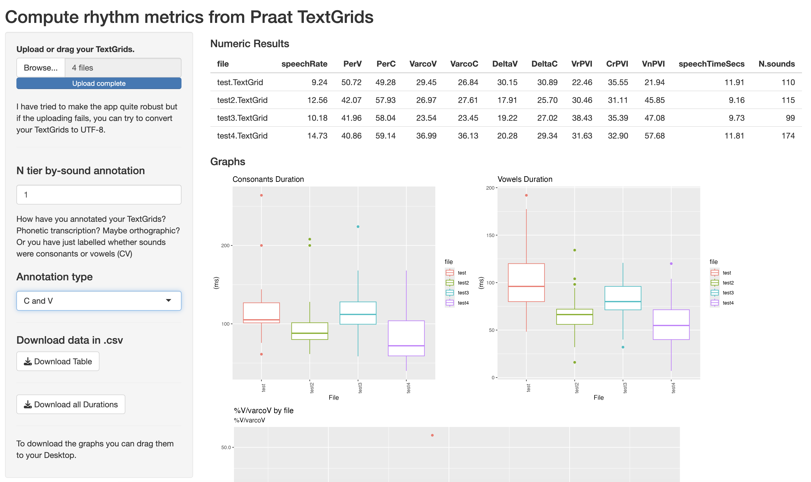

# Rhythm Analysis

**An interactive Shiny app for computing and visualizing rhythm metrics**

This app provides a simple yet effective interface for analyzing rhythmic properties of speech based on annotated TextGrid files. It allows you to compute a variety of standard rhythm metrics and visualize them directly within the app.

👉 **Access the app** via the [the Shiny server](https://wendyelvira.shinyapps.io/rhythm_analysis/)
**Note**: This app is hosted on a public ShinyApps server. If your files contain personal, private, or sensitive data, we recommend **not uploading them here**. Instead, download the code and run it locally using **RStudio** with the `shiny` package, or deploy it to a secure server managed by your institution.

---

## Input Requirements

- **At least two** Praat **TextGrid** files (or more), containing labeled intervals for consonants and vowels.
- Encoding: **UTF-16** preferred.
- The transcription can be located in any tier — just specify which tier to use.
- Compatible transcription formats include:
  - **Orthographic**
  - **Phonetic**
  - **PTK / a**
  - **C / V**

---

## Output

- A set of **numeric rhythm metrics**, including:
  - Speech rate (sounds/second)
  - %V (percentage of vocalic intervals)
  - %C (percentage of consonantal intervals)
  - VarcoV / VarcoC
  - DeltaV / DeltaC
- **Visualizations**:
  - Interactive plots of duration data and rhythm metrics
- **Downloadable data**:
  - Duration database
  - Computed rhythm metrics as a `.csv` file

---

> 📌 **Citation**: If you use this app in your research, please cite:  
> Elvira-García, Wendy. (2025). *Rhythm Analysis: A Shiny Interface for computation and visualization of rhythm metrics*.  [DOI or URL.] (https://doi.org/10.5281/zenodo.15401985)

